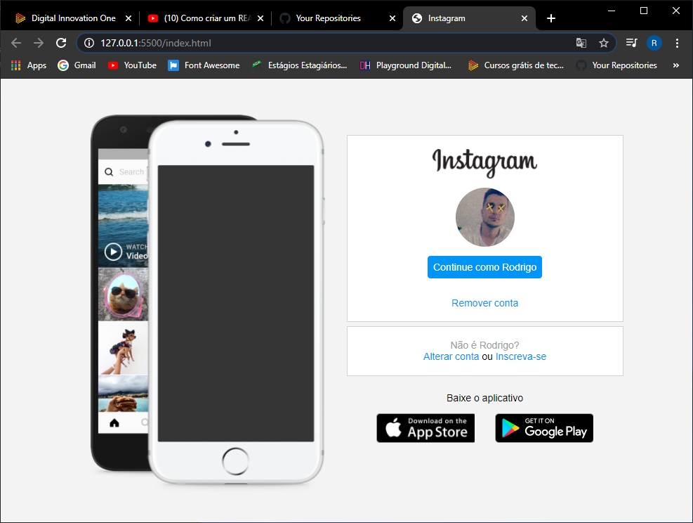

<h1 align ="center">Instagram</h1>

<h2 align = "center">
    </img>
</h2>

---
#Indice
- [Sobre](#-Sobre)
- [tecnologias](#-Tecnologias)

---

 ### 📑 Sobre : 
 Este projeto é baseado na aula "Recriando a página inicial do Instagram" disponibilizada pela [Digital innovation one](https://web.digitalinnovation.one/), ministrada pela [Gabriela Pinheiro](https://www.linkedin.com/in/gabrielapinheiro129/?trk=public-profile-join-page). Nesse projeto são trabalhados conceitos sobre Css FlexBox *( "Método capaz de organizar elementos em uma interface")* e responsividade.

 ---

 ### ⚙ Tecnologias :
 Atualmente o projeto se baseia apenas nas tecnologias HTML e CSS

 ---

 © Desenvolvido por Rodrigo Nascimento 🚀

